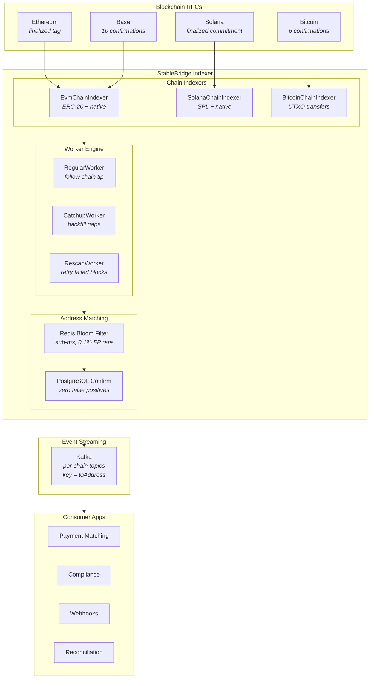
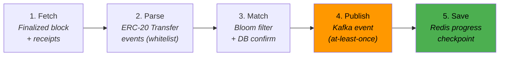
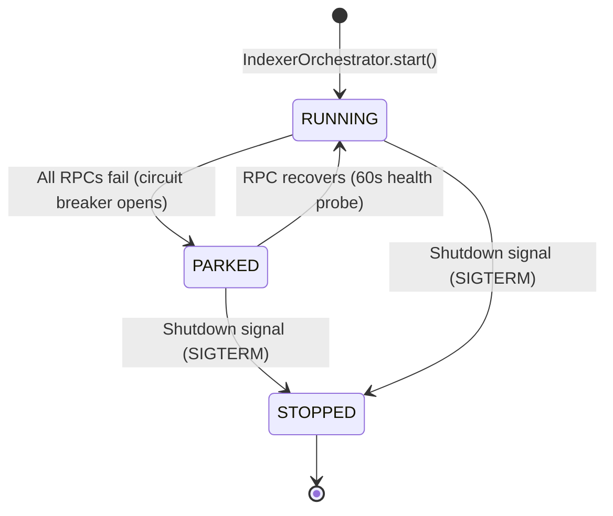

<div align="center">


[](https://deepwiki.com/Puneethkumarck/stablebridge-indexer)

# stablebridge-indexer

**Multichain stablecoin deposit detection — index finalized blocks across EVM, Solana, and Bitcoin with zero false positives and at-least-once delivery guarantees**

[Architecture](#-architecture) | [Quick Start](#-quick-start) | [API Reference](#-api-reference) | [Configuration](#-configuration) | [Design Decisions](#-key-design-decisions)

</div>

---

## The Problem

Watching millions of blockchain transactions across multiple chains for your specific wallet addresses is slow, error-prone, and expensive. Miss a deposit and you lose revenue. Detect a false positive and you credit money that never arrived.

## The Solution

StableBridge Indexer processes only **finalized blocks** (zero reorg risk) and uses a **Redis Bloom filter for sub-millisecond address matching** followed by **PostgreSQL confirmation** (zero false positives). Transfer events stream to Kafka with **at-least-once delivery** — duplicates are safe with idempotent consumers, but missed deposits are catastrophic.

## The Result

Real-time stablecoin deposit detection across three chain types, ready for payment matching, compliance, webhooks, and reconciliation.

<div align="center">

| Metric | Value |
|--------|-------|
| **Chains** | EVM + Solana + Bitcoin |
| **Finality** | Zero reorg risk (finalized blocks only) |
| **False positives** | Zero (Bloom + DB confirm) |
| **Delivery** | At-least-once (Kafka before Redis) |
| **Throughput** | Virtual Threads + batch JSON-RPC |
| **Recovery** | Auto-healing workers (PARKED -> RUNNING) |

</div>

---

## Tech Stack

| Technology | Version | Purpose |
|-----------|---------|---------|
| **Java** | 25 | Language runtime with virtual threads |
| **Spring Boot** | 4.0.3 | Application framework |
| **Gradle** | 9.0.0 (Kotlin DSL) | Build system |
| **PostgreSQL** | 16 | Wallet address storage |
| **Redis Stack** | latest | Bloom filter + block progress tracking |
| **Redpanda** | v24.3.1 | Kafka-compatible event streaming |
| **Resilience4j** | 2.3.0 | Circuit breaker, retry, rate limiter per chain |
| **MapStruct** | 1.6.3 | Type-safe DTO mapping at layer boundaries |
| **Flyway** | 12.1.1 | Database schema migrations |
| **ArchUnit** | 1.4.1 | Hexagonal architecture enforcement at build time |
| **WireMock** | 3.13.2 | RPC client HTTP mocking in tests |
| **Testcontainers** | 1.21.4 | Real PostgreSQL, Redis, Kafka in integration tests |
| **Prometheus** | v3.4.0 | Metrics collection and alerting |
| **Grafana** | 11.6.0 | Dashboards and visualization |
| **Jib** | (Gradle plugin) | Docker image build (no Dockerfile needed) |

---

## Architecture



The project follows **hexagonal architecture** with 5 ArchUnit rules enforced at build time:

```
domain/                    Pure business logic — no framework imports
  model/                   Transfer, IndexedBlock, BlockResult, WalletAddress, enums
  port/                    ChainIndexer, AddressFilter, TransferEventPublisher,
                           BlockProgressStore, WalletAddressRepository
  service/                 RegularWorker, CatchupWorker, RescanWorker,
                           IndexerOrchestrator, WalletCommandHandler, StatusQueryHandler
  event/                   TransferDetectedEvent

infrastructure/            Framework adapters — implements domain ports
  chain/evm/               EvmChainIndexer, EvmRpcClient, ERC-20 + native parsers
  chain/solana/            SolanaChainIndexer, SPL token + native parsers
  chain/bitcoin/           BitcoinChainIndexer, UTXO transfer parser
  bloom/                   RedisBloomAddressFilter, GuavaBloomAddressFilter
  progress/                RedisBlockProgressStore
  persistence/             WalletAddressEntity, JPA adapter
  messaging/               KafkaTransferEventPublisher
  security/                ApiKeyAuthFilter

application/               Spring Boot wiring — controllers, config, properties
  config/                  ChainAutoConfiguration, KafkaConfig, RedisConfig
  controller/              WalletController, StatusController
  properties/              IndexerProperties, ChainProperties, RpcProperties
```

### Module Structure

| Module | Purpose |
|--------|---------|
| `stablebridge-indexer` | Main application — domain, infrastructure, application layers |
| `stablebridge-indexer-api` | Shared DTOs: TransferEvent, NetworkType, WalletAddressRequest/Response |
| `stablebridge-indexer-client` | Feign client for wallet management API |

---

## Project Structure

```
stablebridge-indexer/
├── stablebridge-indexer/              # Main application module
│   └── src/
│       ├── main/java/.../indexer/
│       │   ├── domain/                # Pure business logic (records, ports, services)
│       │   ├── infrastructure/        # Chain indexers, Bloom, Redis, Kafka, JPA adapters
│       │   └── application/           # Controllers, Spring config, properties
│       ├── main/resources/
│       │   ├── application.yml        # Main configuration
│       │   ├── application-testnet.yml # Testnet overrides (Sepolia, Devnet)
│       │   ├── logback-spring.xml     # Structured JSON logging
│       │   └── db/migration/          # Flyway SQL migrations
│       ├── test/                      # Unit tests (41 test files)
│       ├── integration-test/          # Integration tests (Testcontainers)
│       └── testFixtures/              # Shared test factories (*Fixtures.java)
├── stablebridge-indexer-api/          # Shared DTOs (TransferEvent, NetworkType)
├── stablebridge-indexer-client/       # Feign client + ApiKey interceptor
├── buildSrc/                          # Custom Gradle plugin (shared deps, Jib, test config)
├── infra/
│   ├── prometheus/                    # Scrape config + 6 alert rules
│   ├── grafana/                       # Auto-provisioned datasource + 8-panel dashboard
│   └── terraform/                     # Docker provider IaC (alternative to Compose)
├── docs/                              # ADRs, specs, test plans, live test results
├── postman/                           # API test collections (Newman)
├── docker-compose.yml                 # Local dev: PostgreSQL, Redis, Redpanda, Prometheus, Grafana
├── Makefile                           # 30+ CLI shortcuts
├── build.gradle.kts                   # Root build config
├── settings.gradle.kts                # Module configuration
└── .env.example                       # Environment variable template
```

---

## How It Works

### Block Processing Pipeline

Every block goes through a five-stage pipeline inside `BaseWorker.processBlock()`:



> **Critical ordering**: Step 4 (Kafka publish) happens **before** step 5 (Redis save). If the app crashes between them, the block is reprocessed on restart — duplicates are safe, missed deposits are not.

| Stage | Component | What It Does |
|-------|-----------|-------------|
| **Fetch** | `EvmRpcClient` | Fetches finalized block + transaction receipts via JSON-RPC batch (150 receipts -> 3 HTTP calls) |
| **Parse** | `EvmErc20TransferParser` | Scans receipt logs for `Transfer(address,address,uint256)` events matching whitelisted token contracts |
| **Match** | `RedisBloomAddressFilter` + `WalletAddressRepository` | Bloom filter (sub-ms) eliminates 99.9%+ non-matches, then PostgreSQL confirms — zero false positives |
| **Publish** | `KafkaTransferEventPublisher` | Sends to `transfer.events.<chainId>`, key = `toAddress`, idempotent producer enabled |
| **Save** | `RedisBlockProgressStore` | Persists last processed block number to Redis Hash `indexer:progress` |

### ERC-20 Transfer Parsing

The `EvmErc20TransferParser` extracts token transfers from transaction receipt logs:

1. **Filter**: Only receipts with `status=1` (successful) and logs matching the `Transfer(address,address,uint256)` event signature
2. **Whitelist**: Only logs from configured token contract addresses (case-insensitive match)
3. **Decode**: `topic[1]` = sender (last 20 bytes), `topic[2]` = recipient, `log.data` = raw amount
4. **Normalize**: Both `rawAmount` (on-chain integer) and `amount` (human-readable via `rawAmount / 10^decimals`) are preserved

Native transfers (ETH, SOL, BTC) follow similar parsing but are disabled by default — enable with `index-native-transfers: true` per chain.

### RPC Resilience Stack

Every RPC call passes through three layers of protection:

| Layer | Component | Behavior |
|-------|-----------|----------|
| **URL failover** | `RpcUrlManager` | Round-robin across URLs, 3-failure threshold marks URL unhealthy, 60s health probe for recovery |
| **Resilience4j** | `ResilientEvmRpcClient` | RateLimiter (25 rps) -> Retry (exponential backoff, 3 attempts) -> CircuitBreaker (50% failure threshold) |
| **HTTP client** | `EvmRpcClient` | JDK HttpClient (HTTP/1.1) with virtual thread executor, JSON-RPC batch requests, configurable timeout |

If all RPCs fail, the circuit breaker opens and the worker transitions to **PARKED** state. A background health probe runs every 60 seconds — when an RPC recovers, the worker auto-resumes to **RUNNING**.

### Bloom + DB Double-Check

This is the core matching strategy that makes the system both fast and financially correct:

```
                    ┌─────────────────────┐
  Transfer found    │  Redis Bloom Filter  │  Sub-millisecond, 0.1% false positive rate
  in block logs  ──>│  BF.EXISTS key addr  │  Per-network-type: indexer:bloom:EVM, :SOLANA, :BITCOIN
                    └────────┬────────────┘
                             │ might contain?
                    ┌────────v────────────┐
                    │  PostgreSQL Confirm  │  Zero false positives
                    │  SELECT EXISTS(...)  │  wallet_addresses table
                    └────────┬────────────┘
                             │ confirmed?
                    ┌────────v────────────┐
                    │   Kafka Publish     │  topic: transfer.events.<chainId>
                    │   key: toAddress    │  At-least-once delivery
                    └─────────────────────┘
```

The Bloom filter eliminates 99.9%+ of non-matching transfers in sub-millisecond time. Only the rare Bloom hits reach the database — this keeps PostgreSQL load minimal even at millions of transfers per day.

---

## Quick Start

### Prerequisites

- **Java 25** ([Eclipse Temurin](https://adoptium.net/))
- **Docker** and Docker Compose
- **Gradle 9.0** (wrapper included — no manual install needed)
- An **RPC endpoint** for at least one chain (e.g., [Alchemy](https://www.alchemy.com/), [Infura](https://www.infura.io/))

### 1. Clone and start infrastructure

```bash
git clone https://github.com/Puneethkumarck/stablebridge-indexer.git
cd stablebridge-indexer
cp .env.example .env          # Edit with your RPC URLs
docker compose up -d           # PostgreSQL, Redis, Redpanda, Prometheus, Grafana
```

### 2. Configure environment

```bash
# Required
export INDEXER_API_KEY=your-api-key
export ETHEREUM_RPC_URL=https://eth-mainnet.g.alchemy.com/v2/YOUR_KEY

# Optional — infrastructure defaults work with docker-compose
export DB_USERNAME=indexer
export DB_PASSWORD=indexer
export REDIS_HOST=localhost
export KAFKA_BOOTSTRAP_SERVERS=localhost:19092
```

### 3. Build and run

```bash
./gradlew build                              # Compile + Spotless + all tests
./gradlew :stablebridge-indexer:bootRun      # Start the indexer
```

Or use Make for a one-command experience:

```bash
make up              # Build Docker image + start infra + app
make up-testnet      # Same but with testnet profile (Sepolia, Solana Devnet)
```

### 4. Register a wallet address

```bash
curl -X POST http://localhost:8080/api/v1/wallets \
  -H "X-API-Key: $INDEXER_API_KEY" \
  -H "Content-Type: application/json" \
  -d '{"address": "0xYourAddress", "networkType": "EVM", "label": "merchant-1"}'
```

### 5. Check indexer status

```bash
curl http://localhost:8080/api/v1/status \
  -H "X-API-Key: $INDEXER_API_KEY"
```

The indexer is now watching all finalized Ethereum blocks for stablecoin transfers to your registered address. Matched transfers stream to Kafka topic `transfer.events.ETHEREUM_MAINNET`.

---

## Configuration

All configuration lives in `application.yml` with environment variable overrides.

### Chain Configuration

```yaml
indexer:
  chains:
    ethereum_mainnet:
      enabled: true
      type: evm
      confirmation-strategy: finalized    # or "confirmations" with min-confirmations
      index-native-transfers: false       # true to track ETH transfers
      native-decimals: 18
      start-block: 0
      poll-interval: 12s
      batch-size: 10
      rpc:
        urls:
          - ${ETHEREUM_RPC_URL}
        timeout: 10s
        batch-size: 50                    # JSON-RPC batch size
        use-block-receipts: false         # true for eth_getBlockReceipts support
      token-contracts:
        - address: "0xA0b86991c6218b36c1d19D4a2e9Eb0cE3606eB48"
          symbol: USDC
          decimals: 6
        - address: "0xdAC17F958D2ee523a2206206994597C13D831ec7"
          symbol: USDT
          decimals: 6
```

### Bloom Filter

```yaml
indexer:
  bloom:
    backend: redis          # "redis" for production, "guava" for local dev
    error-rate: 0.001       # 0.1% false positive rate
    expected-insertions: 1000000
```

### Supported Chains

| Chain | Type | Finality Strategy | Stablecoins |
|-------|------|-------------------|-------------|
| Ethereum Mainnet | EVM | `finalized` tag | USDC, USDT, DAI, PYUSD, EURC |
| Base Mainnet | EVM | 10 confirmations | USDC, EURC |
| Solana Mainnet | Solana | `finalized` commitment | USDC, USDT |
| Bitcoin Mainnet | Bitcoin | 6 confirmations | Native BTC (UTXO) |

### Environment Variables

| Variable | Default | Description |
|----------|---------|-------------|
| **API** | | |
| `INDEXER_API_KEY` | `change-me` | API authentication key (`X-API-Key` header) |
| **Infrastructure** | | |
| `DB_USERNAME` | `indexer` | PostgreSQL username |
| `DB_PASSWORD` | `indexer` | PostgreSQL password |
| `REDIS_HOST` | `localhost` | Redis host |
| `REDIS_PORT` | `6379` | Redis port |
| `KAFKA_BOOTSTRAP_SERVERS` | `localhost:19092` | Kafka broker address |
| **Mainnet RPC** | | |
| `ETHEREUM_RPC_URL` | — | Ethereum mainnet JSON-RPC endpoint |
| `BASE_RPC_URL` | — | Base mainnet JSON-RPC endpoint |
| `SOLANA_RPC_URL` | `https://api.mainnet-beta.solana.com` | Solana mainnet RPC endpoint |
| `BITCOIN_RPC_URL` | `http://localhost:8332` | Bitcoin Core RPC endpoint |
| `BITCOIN_RPC_USERNAME` | `bitcoin` | Bitcoin RPC auth username |
| `BITCOIN_RPC_PASSWORD` | `bitcoin` | Bitcoin RPC auth password |
| **Testnet RPC** | | |
| `SEPOLIA_RPC_URL` | — | Ethereum Sepolia RPC endpoint |
| `BASE_SEPOLIA_RPC_URL` | — | Base Sepolia RPC endpoint |
| `SOLANA_DEVNET_RPC_URL` | `https://api.devnet.solana.com` | Solana Devnet RPC endpoint |
| `BITCOIN_TESTNET_RPC_URL` | `http://localhost:18332` | Bitcoin Testnet RPC endpoint |

---

## API Reference

All endpoints require the `X-API-Key` header. The application runs on port `8080`, with management endpoints on port `8081`.

### Wallet Management

| Method | Endpoint | Description |
|--------|----------|-------------|
| `POST` | `/api/v1/wallets` | Register a wallet address for monitoring |
| `POST` | `/api/v1/wallets/batch` | Register multiple wallet addresses |
| `GET` | `/api/v1/wallets?networkType=EVM` | List wallets by network type |
| `DELETE` | `/api/v1/wallets/{address}?networkType=EVM` | Remove a wallet address |
| `POST` | `/api/v1/wallets/bloom/rebuild` | Rebuild the Bloom filter |

### Status & Health

| Method | Endpoint | Description |
|--------|----------|-------------|
| `GET` | `/api/v1/status` | All chain indexer statuses |
| `GET` | `/api/v1/status/{chainName}` | Status for a specific chain |
| `GET` | `/api/v1/status/bloom` | Bloom filter status |

### Management (port 8081)

| Method | Endpoint | Description |
|--------|----------|-------------|
| `GET` | `/actuator/health` | Health check with component details |
| `GET` | `/actuator/prometheus` | Prometheus metrics |

### Example: Register and Verify

```bash
# Register a wallet
curl -X POST http://localhost:8080/api/v1/wallets \
  -H "X-API-Key: $INDEXER_API_KEY" \
  -H "Content-Type: application/json" \
  -d '{"address": "0xd8dA6BF26964aF9D7eEd9e03E53415D37aA96045", "networkType": "EVM", "label": "vitalik"}'

# Batch register
curl -X POST http://localhost:8080/api/v1/wallets/batch \
  -H "X-API-Key: $INDEXER_API_KEY" \
  -H "Content-Type: application/json" \
  -d '[
    {"address": "0xAddress1", "networkType": "EVM", "label": "merchant-1"},
    {"address": "0xAddress2", "networkType": "EVM", "label": "merchant-2"}
  ]'

# Check indexer status
curl http://localhost:8080/api/v1/status \
  -H "X-API-Key: $INDEXER_API_KEY"

# Check Bloom filter stats
curl http://localhost:8080/api/v1/status/bloom \
  -H "X-API-Key: $INDEXER_API_KEY"

# List registered wallets
curl "http://localhost:8080/api/v1/wallets?networkType=EVM" \
  -H "X-API-Key: $INDEXER_API_KEY"

# Delete a wallet
curl -X DELETE "http://localhost:8080/api/v1/wallets/0xAddress1?networkType=EVM" \
  -H "X-API-Key: $INDEXER_API_KEY"

# Rebuild Bloom filter (after bulk DB changes)
curl -X POST http://localhost:8080/api/v1/wallets/bloom/rebuild \
  -H "X-API-Key: $INDEXER_API_KEY"
```

---

## Database Schema

The indexer uses PostgreSQL for wallet address storage only. Block progress and Bloom filter state live in Redis for write-heavy performance.

### `wallet_addresses` Table

Managed by Flyway migration `V1__create_wallet_addresses_table.sql`:

| Column | Type | Constraints | Description |
|--------|------|-------------|-------------|
| `id` | `BIGSERIAL` | `PRIMARY KEY` | Auto-increment ID |
| `address` | `VARCHAR(255)` | `NOT NULL` | Blockchain address (hex for EVM, base58 for Solana) |
| `network_type` | `VARCHAR(20)` | `NOT NULL`, `CHECK IN ('EVM','SOLANA','BITCOIN')` | Network scope — one registration covers all chains of that type |
| `label` | `VARCHAR(255)` | nullable | Human-readable label (e.g., "merchant-1") |
| `active` | `BOOLEAN` | `NOT NULL DEFAULT TRUE` | Active/inactive toggle |
| `created_at` | `TIMESTAMP WITH TIME ZONE` | `NOT NULL DEFAULT NOW()` | Creation timestamp |
| `updated_at` | `TIMESTAMP WITH TIME ZONE` | `NOT NULL DEFAULT NOW()` | Last update timestamp |

### Constraints & Indexes

| Name | Type | Columns | Purpose |
|------|------|---------|---------|
| `uq_wallet_addresses_address_network_type` | `UNIQUE` | `(address, network_type)` | One address per network type |
| `idx_wallet_addresses_network_type` | `INDEX` | `network_type` | Fast Bloom filter loading at startup |
| `idx_wallet_addresses_active` | `INDEX` | `active` | Efficient active/inactive filtering |
| `chk_wallet_addresses_network_type` | `CHECK` | `network_type` | Enforces valid values: `EVM`, `SOLANA`, `BITCOIN` |

### Redis Data Structures

| Key Pattern | Type | Purpose |
|-------------|------|---------|
| `indexer:progress` | Hash | Last processed block number per chain (field = chainId) |
| `indexer:failed:<chainId>` | Sorted Set | Failed block numbers with retry timestamps (score = next retry time) |
| `indexer:catchup:<chainId>` | Hash | Catchup range tracking (startBlock, endBlock) |
| `indexer:bloom:EVM` | Bloom Filter | Address set for EVM chains (0.1% FP rate) |
| `indexer:bloom:SOLANA` | Bloom Filter | Address set for Solana |
| `indexer:bloom:BITCOIN` | Bloom Filter | Address set for Bitcoin |

---

## Transfer Event Payload

When a matching transfer is detected, the indexer publishes a `TransferEvent` to Kafka. This is the contract that all consumers must implement against.

**Topic**: `transfer.events.<chainId>` (e.g., `transfer.events.ETHEREUM_MAINNET`)
**Key**: `toAddress` (ensures per-wallet ordering for balance crediting)
**Dedup key**: `txHash + toAddress + networkType` (consumers must implement)

```json
{
  "txHash": "0xabc123...def",
  "fromAddress": "0x1234...5678",
  "toAddress": "0xabcd...ef01",
  "rawAmount": "1000000",
  "amount": 1.000000,
  "decimals": 6,
  "tokenSymbol": "USDC",
  "tokenContractAddress": "0xA0b86991c6218b36c1d19D4a2e9Eb0cE3606eB48",
  "blockNumber": 19500000,
  "blockHash": "0xblock...",
  "transactionIndex": 42,
  "logIndex": 7,
  "chainId": "ETHEREUM_MAINNET",
  "networkType": "EVM",
  "timestamp": "2026-03-15T10:30:00Z",
  "nativeTransfer": false,
  "direction": "INBOUND",
  "detectedAt": "2026-03-15T10:30:12Z"
}
```

| Field | Type | Description |
|-------|------|-------------|
| `txHash` | String | Transaction hash on the blockchain |
| `fromAddress` | String | Sender address |
| `toAddress` | String | Recipient address (matched against wallet registry) |
| `rawAmount` | String | On-chain integer amount (no decimal conversion) |
| `amount` | BigDecimal | Human-readable amount (`rawAmount / 10^decimals`) |
| `decimals` | int | Token decimal places (6 for USDC/USDT, 18 for DAI) |
| `tokenSymbol` | String | Token symbol (USDC, USDT, DAI, PYUSD, EURC) |
| `tokenContractAddress` | String | Token contract address (null for native transfers) |
| `blockNumber` | long | Block number where the transfer occurred |
| `blockHash` | String | Block hash |
| `transactionIndex` | int | Transaction position within the block |
| `logIndex` | int | Log position within the transaction receipt |
| `chainId` | String | Chain identifier (e.g., `ETHEREUM_MAINNET`, `SOLANA_CHAIN`) |
| `networkType` | String | Network type: `EVM`, `SOLANA`, or `BITCOIN` |
| `timestamp` | Instant | Block timestamp from the blockchain |
| `nativeTransfer` | boolean | `true` for ETH/SOL/BTC transfers, `false` for token transfers |
| `direction` | String | Transfer direction: `INBOUND` |
| `detectedAt` | Instant | When the indexer detected this transfer |

---

## Observability

### Prometheus Metrics

The indexer exposes custom metrics on port `8081` at `/actuator/prometheus`:

| Metric | Type | Description |
|--------|------|-------------|
| `indexer_chain_lag` | Gauge | Block lag per chain |
| `indexer_blocks_processed_total` | Counter | Blocks processed per chain |
| `indexer_blocks_failed_total` | Counter | Failed blocks per chain |
| `indexer_transfers_detected_total` | Counter | Transfers detected per chain |
| `indexer_kafka_publish_failed_total` | Counter | Kafka publish failures |
| `indexer_bloom_size` | Gauge | Bloom filter size per network type |
| `indexer_rpc_latency_seconds` | Histogram | RPC call latency per chain/method |

### Alert Rules

Six alert rules are preconfigured in `infra/prometheus/alerts.yml`:

| Alert | Severity | Condition |
|-------|----------|-----------|
| IndexerChainLagHigh | P1 Critical | Chain lag > 50 blocks for 5 min |
| IndexerChainDown | P1 Critical | Indexer unreachable for 3 min |
| IndexerKafkaPublishFailed | P1 Critical | Any Kafka publish failures |
| IndexerRpcErrorRate | P2 Warning | RPC error rate > 50% for 2 min |
| IndexerFailedBlocks | P2 Warning | > 10 failed blocks for 5 min |
| IndexerBloomFilterEmpty | P2 Warning | Empty Bloom filter for 5 min |

### Dashboards

Grafana is included in `docker-compose.yml` with a preconfigured 8-panel dashboard:

- **URL**: http://localhost:3000 (admin/admin)
- **Dashboard**: `infra/grafana/dashboards/indexer-dashboard.json`
- **Datasource**: Auto-provisioned from `infra/grafana/provisioning/`

### Structured Logging

All logs use structured JSON format (Logstash Logback encoder) with 10 enriched MDC fields for audit trails and merchant dispute resolution.

---

## Worker Engine

Three workers run concurrently per chain on virtual threads:

| Worker | Job | Frequency |
|--------|-----|-----------|
| **RegularWorker** | Polls the chain tip for new finalized blocks, processes them sequentially | `pollInterval` (12s Ethereum, 2s Base) |
| **CatchupWorker** | Backfills gaps between current progress and chain tip, splits into parallel chunks | Continuous until caught up |
| **RescanWorker** | Retries failed blocks from Redis sorted set with exponential backoff (1s -> 16s, max 5 attempts) | Every 5 minutes |

The `IndexerOrchestrator` bootstraps everything on startup:
1. Loads all registered wallet addresses from PostgreSQL into the Bloom filter
2. Creates a virtual thread executor (`Executors.newVirtualThreadPerTaskExecutor()`)
3. Launches 3 workers per enabled chain

### Worker State Machine



- Workers auto-recover from transient RPC failures
- PARKED state triggers a 60-second health probe cycle
- Graceful shutdown: `SIGTERM` -> stop polling -> drain 30s -> flush Kafka -> save progress -> exit

---

## Delivery Guarantees

| Guarantee | Implementation |
|-----------|---------------|
| **At-least-once delivery** | Kafka publish happens BEFORE Redis progress save. If the process crashes after Kafka but before Redis, the block is reprocessed on restart. |
| **Zero false positives** | Bloom filter match is always confirmed against PostgreSQL `wallet_addresses` table. |
| **Consumer idempotency** | Dedup key: `txHash + toAddress + networkType`. All consumers must implement this. |
| **Finality-first** | Only finalized blocks are indexed. No reorg detection needed. |
| **Whitelist-only tokens** | Only configured stablecoin contracts are parsed. Unknown tokens are skipped. |

### Kafka Topics

Events are published to per-chain topics with the pattern `transfer.events.<chainId>`:

- Key: `toAddress` (ensures per-wallet ordering for balance crediting)
- Retention: 30 days
- Serialization: JSON (Jackson)
- Idempotent producer enabled

---

## Key Design Decisions

| # | Decision | Choice | Problem It Solves |
|---|----------|--------|-------------------|
| 1 | **Finalized blocks only** | No reorg detection | Block reorganizations can reverse transactions — indexing only finalized blocks eliminates financial risk entirely |
| 2 | **Bloom + DB confirm** | Double-check pattern | A Bloom filter alone has 0.1% false positives — unacceptable for financial systems. DB confirm eliminates them while keeping 99.9% of lookups in sub-millisecond Redis |
| 3 | **Kafka before Redis** | At-least-once ordering | If progress is saved before publishing, a crash loses the transfer event. Reversing the order means duplicates (safe) instead of data loss (catastrophic) |
| 4 | **Per-chain Kafka topics** | `transfer.events.<chainId>` | Chain-level fault isolation — a slow Bitcoin consumer doesn't block Ethereum event processing |
| 5 | **Virtual Threads** | Single global executor | Platform threads are expensive; virtual threads handle thousands of concurrent tasks. RPC rate limits (not threads) are the real bottleneck |
| 6 | **JDK HttpClient** | No Spring WebClient | Direct HTTP/1.1 client with virtual threads gives maximum RPC throughput with zero Spring coupling in infrastructure |
| 7 | **JSON-RPC batch** | Configurable batch size (default 50) | Ethereum blocks have ~150 transactions. Without batching, that's 150 HTTP calls. With batch size 50, it's 3 calls |
| 8 | **Redis for progress** | Hash + Sorted Set | Block progress is write-heavy (every block). Redis handles this at microsecond latency. PostgreSQL is reserved for read-mostly wallet addresses |
| 9 | **API key auth** | `X-API-Key` header | Internal service-to-service communication. OAuth2/JWT is deferred until external-facing deployment is needed |

For the full set of 21 architecture decisions with status, rationale, and consequences, see [`docs/architecture-decisions.md`](docs/architecture-decisions.md).

---

## Make Commands

A `Makefile` wraps all common operations:

### Build & Test

```bash
make build              # Compile + Spotless + all tests
make test               # Unit tests only
make integration-test   # Integration tests (requires Docker services)
make clean              # Clean build artifacts
```

### Run (one command — everything in containers)

```bash
make up                 # Build image + start infra + app (waits for healthy)
make up-testnet         # Same but with testnet profile (Sepolia, Solana Devnet, ...)
make down               # Stop everything (app + infra)
```

### Run (separate control)

```bash
make infra-up           # Start infra only (PostgreSQL, Redis, Redpanda, Prometheus, Grafana)
make run                # Run app locally via Gradle (connects to Docker infra)
make run-testnet        # Run app locally with testnet profile
make infra-down         # Stop infra containers
make infra-clean        # Stop infra + delete all volumes
make infra-status       # Show container status
make infra-logs         # Tail container logs
```

### Terraform (alternative to Docker Compose)

```bash
make terraform-init     # Initialize Terraform Docker provider
make terraform-up       # Provision all containers via Terraform
make terraform-down     # Destroy Terraform-managed containers
```

### Inspection

```bash
make check-health       # Actuator health check
make check-status       # All chain statuses
make check-redis        # Block progress + Bloom filter info
make check-kafka        # List Kafka topics
```

### Testing & Smoke

```bash
make smoke-test         # Run smoke test script against running indexer
make api-test           # Run Newman/Postman API tests
make register-wallet ADDR=0x... TYPE=EVM   # Register a test wallet
```

### Docker Image

```bash
make docker-build       # Build production image via Jib (eclipse-temurin:25-jre)
```

Run `make help` to see all available targets.

---

## Docker

### Development Infrastructure

```bash
make infra-up
# or: docker compose up -d
```

| Service | Image | Port | Description |
|---------|-------|------|-------------|
| PostgreSQL | `postgres:16-alpine` | 5432 | Wallet address storage |
| Redis Stack | `redis/redis-stack:latest` | 6379 / 8001 (UI) | Bloom filter, block progress, failed blocks |
| Redpanda | `redpandadata/redpanda:v24.3.1` | 19092 (Kafka) | Transfer event streaming |
| Redpanda Console | `redpandadata/console:v2.8.0` | 9090 | Kafka topic browser |
| Prometheus | `prom/prometheus:v3.4.0` | 9091 | Metrics collection |
| Grafana | `grafana/grafana:11.6.0` | 3000 | Dashboards and alerting |

### Production Image

```bash
make docker-build
# or: ./gradlew :stablebridge-indexer:jibDockerBuild
```

- **Image**: `stablebridge/indexer` based on `eclipse-temurin:25-jre`
- **JVM flags**: `-XX:+UseZGC -XX:MaxRAMPercentage=75.0 -XX:+ExitOnOutOfMemoryError`
- **Ports**: 8080 (API), 8081 (management)

---

## Testing

The project has **414 tests** across **44 test files**, organized by category:

```bash
make build              # Full build (Spotless + compile + all tests)
make test               # Unit tests only
make integration-test   # Integration tests (requires Docker services)
```

### API Tests (Newman/Postman)

A Postman collection at `postman/` covers all API endpoints with assertions:

```bash
# Install Newman
npm install -g newman

# Run against local instance
make api-test
# or: newman run postman/stablebridge-indexer.postman_collection.json \
#       -e postman/local.postman_environment.json

# Run against testnet instance
newman run postman/stablebridge-indexer.postman_collection.json \
  -e postman/testnet.postman_environment.json
```

**Test coverage**: Authentication (401 for missing/wrong key), wallet CRUD (register, batch, list, delete, duplicate handling), chain status (all chains, single chain, unknown chain 404), Bloom filter status, Prometheus metrics, health check.

You can also import `postman/stablebridge-indexer.postman_collection.json` directly into Postman for interactive testing.

### Testing Stack

| Tool | Purpose |
|------|---------|
| **JUnit 5** | Test framework |
| **BDDMockito** | `given()`/`then()` style mocking exclusively |
| **ArchUnit** | 5 architectural rules enforced at build time |
| **WireMock** | RPC client adapter tests |
| **Testcontainers** | Integration tests with real PostgreSQL and Redis |
| **TestFixtures** | Shared factory methods in `src/testFixtures/` |

### Architectural Rules (ArchUnit)

| Rule | Enforces |
|------|----------|
| Domain must not depend on infrastructure | Pure domain layer |
| Domain must not depend on application | Domain is innermost layer |
| Domain must not import Spring (except `@Service`, `@Transactional`) | Minimal framework coupling |
| Domain must not import `jakarta.persistence` | JPA stays in infrastructure |
| Infrastructure must not depend on controllers | No reverse dependencies |

---

## Roadmap

### New Chains

| Chain | Type | Priority | Notes |
|-------|------|----------|-------|
| TRON | TVM | High | Large stablecoin volume (USDT dominates on TRON) |
| Aptos | Move | Medium | Growing DeFi ecosystem, Move VM |
| Sui | Move | Medium | gRPC-based ledger service, high throughput |
| Cosmos (ATOM) | Cosmos SDK | Medium | IBC transfers, native USDC via Noble |
| TON | TON | Low | Telegram ecosystem, unique architecture |
| Avalanche C-Chain | EVM | Low | Already supported by EVM indexer (add config only) |
| Arbitrum | EVM | Low | Already supported by EVM indexer (add config only) |
| Optimism | EVM | Low | Already supported by EVM indexer (add config only) |

### Features

| Feature | Priority | Description |
|---------|----------|-------------|
| **Reorg detection** | High | Reactive reorg handling for chains that don't support `finalized` tag — detect parent hash mismatch, rollback and re-index affected blocks |
| **Mempool monitoring** | High | Watch pending transactions for early deposit notification (pre-confirmation) |
| **ManualWorker** | High | On-demand historical backfill for specific block ranges via API — required for merchant onboarding with retroactive deposit detection |
| **OAuth2 / JWT auth** | Medium | Replace API key with OAuth2 for external-facing deployments behind API gateway |
| **Multi-tenancy** | Medium | Per-tenant wallet isolation for SaaS deployment — separate bloom filters and Kafka topics per tenant |
| **WebSocket notifications** | Medium | Real-time push to consumers instead of Kafka polling — useful for webhook-style integrations |
| **Outbox pattern** | Medium | Transactional outbox for Kafka publishing — stronger delivery guarantees by writing events to PostgreSQL first |
| **gRPC API** | Low | Alternative to REST for high-throughput internal service communication |
| **Topic compaction** | Low | Kafka log compaction for infinite retention of latest state per wallet |
| **GraphQL query layer** | Low | Query indexed transfers by wallet, token, time range — useful for merchant dashboards |

### Infrastructure

| Feature | Priority | Description |
|---------|----------|-------------|
| **Kubernetes Helm chart** | High | Production deployment with HPA, PDB, configmaps, secrets |
| **AWS Terraform modules** | Medium | RDS, ElastiCache, MSK, ECS Fargate for cloud deployment |
| **OpenTelemetry tracing** | Medium | Distributed tracing across RPC calls, workers, and Kafka publishing |
| **PagerDuty integration** | Low | Alert routing for P1 incidents (chain down, Kafka publish failures) |

---

## Contributing

1. Fork the repository
2. Create a feature branch: `git checkout -b feature/your-feature`
3. Ensure all checks pass: `./gradlew build`
4. Commit with a descriptive message
5. Push and open a pull request

### Code Style

- Java 25 with `var` for local variables
- Hexagonal architecture (domain must not depend on infrastructure)
- `@Builder(toBuilder = true)` on all records
- BDDMockito (`given`/`then`) for all tests
- Spotless enforced at build time

---

## License

This project is licensed under the MIT License.

---

<div align="center">

Inspired by [fystack/multichain-indexer](https://github.com/fystack/multichain-indexer) — reimplemented in Java/Spring Boot with hexagonal architecture.

</div>
