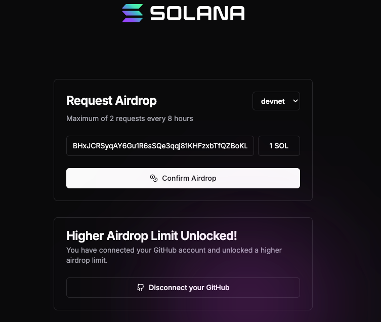
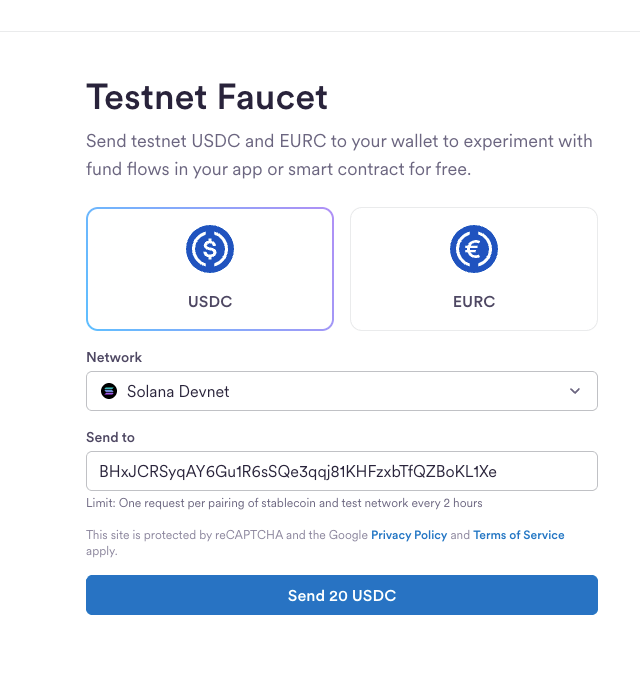
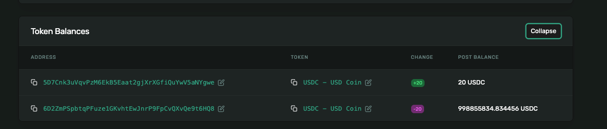

# StableBridge Indexer — Live Testnet Test (Solana Devnet)

> End-to-end verification of the indexer pipeline against Solana Devnet.
> Date: 2026-03-21 | Chain: Solana Devnet | Token: USDC (SPL)

---

## Test Summary

| Item | Detail |
|------|--------|
| **Chain** | Solana Devnet |
| **Token** | USDC SPL (`4zMMC9srt5Ri5X14GAgXhaHii3GnPAEERYPJgZJDncDU`) |
| **Wallet** | `BHxJCRSyqAY6Gu1R6sSQe3qqj81KHFzxbTfQZBoKL1Xe` |
| **Transaction** | [`37N5bGcn...g8y5`](https://explorer.solana.com/tx/37N5bGcnYyggy9Sjvz23w2AM65NWnEbE6j83NUVy3wm4wH5ifU5xoY5Me458pXX6vyk1BkdYzggpPmH9gh8wg8y5?cluster=devnet) |
| **Slot** | 450,022,037 |
| **Amount** | 20 USDC (rawAmount: 20000000, decimals: 6) |
| **Result** | Transfer detected, matched, and published to Kafka |

---

## Step 1: Start Infrastructure

Started all services using Terraform (Docker provider) with Solana Devnet enabled:

```bash
make terraform-up-testnet
```

The `application-testnet.yml` was configured with Solana Devnet enabled and Sepolia disabled (one chain at a time on Alchemy free tier):

```yaml
solana_devnet:
  enabled: true
  type: solana
  confirmation-strategy: finalized
  index-native-transfers: true
  native-decimals: 9
  start-block: ${SOLANA_DEVNET_START_BLOCK:350000000}
  poll-interval: 5s
  batch-size: 1
  rpc:
    urls:
      - ${SOLANA_DEVNET_RPC_URL}       # Alchemy Solana Devnet
  token-contracts:
    - address: "4zMMC9srt5Ri5X14GAgXhaHii3GnPAEERYPJgZJDncDU"
      symbol: USDC
      decimals: 6
```

**Startup logs:**

```
SolanaChainIndexerFactory - Created SolanaChainIndexer for networkId=solana_devnet,
    chainId=SOLANA_DEVNET, indexNativeTransfers=true, tokenContracts=1
KafkaTopicConfiguration - Auto-creating Kafka topic: transfer.events.solana_devnet
IndexerOrchestrator - Initialized bloom filter — networkType=SOLANA, addressCount=0
BaseWorker - Worker state changed — from=STOPPED, to=RUNNING, chain=SOLANA_DEVNET, workerType=REGULAR
BaseWorker - Worker state changed — from=STOPPED, to=RUNNING, chain=SOLANA_DEVNET, workerType=CATCHUP
BaseWorker - Worker state changed — from=STOPPED, to=RUNNING, chain=SOLANA_DEVNET, workerType=RESCAN
IndexerOrchestrator - IndexerOrchestrator started — 1 chain(s), 3 worker(s)
StablebridgeIndexerApplication - Started StablebridgeIndexerApplication in 8.881 seconds
```

---

## Step 2: Register Solana Wallet Address

Registered a Solana devnet wallet via the API:

```bash
curl -X POST http://localhost:8080/api/v1/wallets \
  -H "X-API-Key: $INDEXER_API_KEY" \
  -H "Content-Type: application/json" \
  -d '{"address": "BHxJCRSyqAY6Gu1R6sSQe3qqj81KHFzxbTfQZBoKL1Xe", "networkType": "SOLANA"}'
```

**Response:**

```json
{
  "id": 2,
  "address": "BHxJCRSyqAY6Gu1R6sSQe3qqj81KHFzxbTfQZBoKL1Xe",
  "networkType": "SOLANA",
  "active": true,
  "createdAt": "2026-03-21T13:04:51.866Z"
}
```

### Solana vs EVM Address Handling

Unlike EVM addresses which are case-insensitive (hex), **Solana addresses are case-sensitive** (Base58 encoding). The indexer handles this correctly:

| Chain | Address Format | Case Sensitivity | Normalization |
|-------|---------------|------------------|---------------|
| EVM | Hex (0x...) | Case-insensitive | Lowercase on save |
| Solana | Base58 | Case-sensitive | Preserved as-is |
| Bitcoin | Base58/Bech32 | Case-sensitive | Preserved as-is |

**Bug found during testing:** The initial address normalization fix (for EVM case sensitivity) lowercased ALL addresses, including Solana. This corrupted the Base58 address and prevented matching. Fixed by only lowercasing EVM addresses.

**Bloom filter log:**

```
RedisBloomAddressFilter - Added address to Redis bloom filter
    — networkType=SOLANA, address=BHxJCRSyqAY6Gu1R6sSQe3qqj81KHFzxbTfQZBoKL1Xe
```

---

## Step 3: Attempt SOL Airdrop (Failed to Match)

First attempted a native SOL airdrop via the [Solana Faucet](https://faucet.solana.com):



**Result:** The airdrop was processed on-chain ([slot 450,020,908](https://explorer.solana.com/block/450020908?cluster=devnet)) but the indexer did **not** detect it:

```
Indexed slot 450020908 on SOLANA_DEVNET: 0 transfers
Block processed — blockNumber=450020908, transfers=0
```

**Why?** SOL airdrops use the System Program's `RequestAirdrop` instruction, not a standard `Transfer` instruction. The native transfer parser correctly only matches `Transfer` instructions — airdrops are a devnet-only concept that doesn't exist on mainnet. This is the correct behavior.

---

## Step 4: Send Devnet USDC via Circle Faucet

Sent 20 USDC via the [Circle Testnet Faucet](https://faucet.circle.com):

- Selected **Solana Devnet** network
- Selected **USDC** token
- Pasted wallet address: `BHxJCRSyqAY6Gu1R6sSQe3qqj81KHFzxbTfQZBoKL1Xe`
- Clicked "Send 20 USDC"



---

## Step 5: Verify Transaction on Solana Explorer

The USDC transfer was confirmed on Solana Devnet:

- **Explorer:** [Transaction 37N5bGcn...g8y5](https://explorer.solana.com/tx/37N5bGcnYyggy9Sjvz23w2AM65NWnEbE6j83NUVy3wm4wH5ifU5xoY5Me458pXX6vyk1BkdYzggpPmH9gh8wg8y5?cluster=devnet)
- **Slot:** 450,022,037
- **Token Balances:** +20 USDC to wallet, -20 USDC from Circle faucet



| Field | Value |
|-------|-------|
| Transaction Signature | `37N5bGcnYyggy9Sjvz23w2AM65NWnEbE6j83NUVy3wm4wH5ifU5xoY5Me458pXX6vyk1BkdYzggpPmH9gh8wg8y5` |
| Slot | 450,022,037 |
| Status | Success |
| From (token account) | `H3sjyipQtXAJkvWNkXhDgped7k323kAba8QMwCLcV79w` |
| To (wallet) | `BHxJCRSyqAY6Gu1R6sSQe3qqj81KHFzxbTfQZBoKL1Xe` |
| Token | USDC (`4zMMC9srt5Ri5X14GAgXhaHii3GnPAEERYPJgZJDncDU`) |
| Amount | 20 USDC |

---

## Step 6: Indexer Detects the Transfer

The indexer processed slot 450,022,037 and matched the USDC transfer:

### 6a. SPL Token Transfer Parsed

```
SolanaSpITransferParser - Parsed SPL token transfer:
    token=USDC
    from=H3sjyipQtXAJkvWNkXhDgped7k323kAba8QMwCLcV79w
    to=BHxJCRSyqAY6Gu1R6sSQe3qqj81KHFzxbTfQZBoKL1Xe
    rawAmount=20000000
    on chain=SOLANA_DEVNET
```

### 6b. Bloom Filter Match + DB Confirm

```
Transfer matched — direction=INCOMING
    txHash=37N5bGcnYyggy9Sjvz23w2AM65NWnEbE6j83NUVy3wm4wH5ifU5xoY5Me458pXX6vyk1BkdYzggpPmH9gh8wg8y5
    walletAddress=BHxJCRSyqAY6Gu1R6sSQe3qqj81KHFzxbTfQZBoKL1Xe
    tokenSymbol=USDC
```

### 6c. Published to Kafka

```
KafkaTransferEventPublisher - Publishing transfer event
    topic=transfer.events.SOLANA_DEVNET
    key=BHxJCRSyqAY6Gu1R6sSQe3qqj81KHFzxbTfQZBoKL1Xe
    txHash=37N5bGcn...

Published 1 transfer events — blockNumber=450022037
Block processed — blockNumber=450022037, transfers=1, latency_ms=1407
```

---

## Step 7: Verify Kafka Event

Read the event from the Kafka topic `transfer.events.SOLANA_DEVNET`:

```bash
docker exec indexer-redpanda rpk topic consume transfer.events.SOLANA_DEVNET \
  --brokers localhost:9092 -n 1
```

**Kafka Event:**

```json
{
  "topic": "transfer.events.SOLANA_DEVNET",
  "key": "BHxJCRSyqAY6Gu1R6sSQe3qqj81KHFzxbTfQZBoKL1Xe",
  "value": {
    "txHash": "37N5bGcnYyggy9Sjvz23w2AM65NWnEbE6j83NUVy3wm4wH5ifU5xoY5Me458pXX6vyk1BkdYzggpPmH9gh8wg8y5",
    "fromAddress": "H3sjyipQtXAJkvWNkXhDgped7k323kAba8QMwCLcV79w",
    "toAddress": "BHxJCRSyqAY6Gu1R6sSQe3qqj81KHFzxbTfQZBoKL1Xe",
    "rawAmount": "20000000",
    "amount": 20,
    "decimals": 6,
    "tokenSymbol": "USDC",
    "tokenContractAddress": "4zMMC9srt5Ri5X14GAgXhaHii3GnPAEERYPJgZJDncDU",
    "blockNumber": 450022037,
    "blockHash": "HtctBAAdsV2X45RVZct1c2au5kQsLoxZek1XAekyNmQ3",
    "transactionIndex": 3,
    "logIndex": -1,
    "chainId": "SOLANA_DEVNET",
    "networkType": "SOLANA",
    "timestamp": "2026-03-21T13:13:32Z",
    "nativeTransfer": false,
    "direction": "INCOMING",
    "detectedAt": "2026-03-21T13:14:34.613Z"
  },
  "partition": 0,
  "offset": 0
}
```

**Event validation:**

| Field | Expected | Actual | Match |
|-------|----------|--------|-------|
| txHash | `37N5bGcn...g8y5` | `37N5bGcn...g8y5` | Yes |
| toAddress | `BHxJCRSy...L1Xe` | `BHxJCRSy...L1Xe` | Yes |
| fromAddress | `H3sjyipQ...V79w` | `H3sjyipQ...V79w` | Yes |
| rawAmount | `20000000` | `20000000` | Yes |
| amount | `20` | `20` | Yes |
| decimals | `6` | `6` | Yes |
| tokenSymbol | `USDC` | `USDC` | Yes |
| tokenContractAddress | `4zMMC9sr...DU` | `4zMMC9sr...DU` | Yes |
| blockNumber | `450022037` | `450022037` | Yes |
| chainId | `SOLANA_DEVNET` | `SOLANA_DEVNET` | Yes |
| networkType | `SOLANA` | `SOLANA` | Yes |
| nativeTransfer | `false` | `false` | Yes |
| direction | `INCOMING` | `INCOMING` | Yes |
| key (partition) | `toAddress` | `BHxJCRSy...L1Xe` | Yes |

---

## Bugs Found and Fixed During Testing

### Bug 1: Solana DTO Deserialization (jsonParsed format)

**Problem:** The Solana RPC client uses `encoding: "jsonParsed"` which returns structured objects for instruction data and account keys, but the ACL DTOs expected raw strings.

**Error:**
```
SolanaRpcException: RPC response parse error: method=getBlock,
    error=Cannot deserialize value of type `java.lang.String` from Object value
```

**Root cause:** Two fields had wrong types:
- `SolanaInstruction.data` was `String` — but `jsonParsed` returns either a string (raw) or an object (parsed)
- `SolanaTransactionMessage.accountKeys` was `List<String>` — but `jsonParsed` returns `[{"pubkey": "...", "signer": true, ...}]`

**Fix:**
- Changed `SolanaInstruction.data` to `Object`, added `parsed` and `program` fields
- Changed `SolanaTransactionMessage.accountKeys` to `List<Object>`
- Added `extractPubkeys()` helper in `SolanaNativeTransferParser` to extract pubkey strings from account key objects

### Bug 2: Address Case Normalization Applied to Solana

**Problem:** The EVM case-sensitivity fix lowercased ALL addresses, including Solana Base58 addresses. Lowercasing a Base58 address changes it to a completely different (invalid) address.

**Symptom:**
```json
{
  "address": "bhxjcrsyqay6gu1r6ssqe3qqj81khfzxbtfqzbokl1xe"  // WRONG - invalid Base58
}
```

**Fix:** Only normalize EVM addresses to lowercase. Solana (Base58) and Bitcoin (Base58/Bech32) addresses are stored and matched as-is.

```java
var normalizedAddress = networkType == NetworkType.EVM ? address.toLowerCase() : address;
```

### Bug 3: Orchestrator Could Not Resolve Solana/Bitcoin Chain Properties

**Problem:** `IndexerOrchestrator.resolveChainProperties()` only called `EvmChainIndexerFactory.resolveChainId()` to match network IDs to chain IDs. Solana and Bitcoin network IDs (`solana_devnet`, `bitcoin_testnet`) were unrecognized, so the orchestrator skipped them:

```
IndexerOrchestrator - No chain properties found for chainId=SOLANA_DEVNET — skipping
```

**Fix:** Try all three chain factories (EVM, Solana, Bitcoin) when resolving chain IDs.

### Non-Bug: SOL Airdrop Not Detected

**Behavior:** SOL airdrops via `RequestAirdrop` are **not detected** by the native transfer parser.

**Why this is correct:** Airdrops use a special devnet-only System Program instruction, not a standard `Transfer` instruction. On mainnet, SOL moves only via transfers — so the parser correctly filters for transfer instructions only. No fix needed.

---

## Pipeline Summary (Solana)

```
Circle Faucet sends 20 USDC (SPL) to BHxJCRSy...
          |
          v
Solana Devnet slot 450,022,037 (finalized)
          |
          v
SolanaRpcClient fetches block via getBlock (jsonParsed encoding)
          |
          v
SolanaSpITransferParser finds SPL Transfer instruction
  mint=4zMMC9sr... (USDC whitelist match)
  from=H3sjyipQ... to=BHxJCRSy... rawAmount=20000000
          |
          v
RedisBloomAddressFilter.mightContain("BHxJCRSy...") -> true (sub-ms)
          |
          v
WalletAddressRepository.existsByAddress("BHxJCRSy...") -> true (DB confirm)
          |
          v
KafkaTransferEventPublisher -> transfer.events.SOLANA_DEVNET (key=toAddress)
          |
          v
RedisBlockProgressStore.saveLastProcessedBlock(SOLANA_DEVNET, 450022037)
```

**Total detection latency:** ~1.4 seconds (block fetch + parse + match + Kafka publish)

---

## Comparison: Sepolia vs Solana Devnet

| Aspect | Sepolia (EVM) | Solana Devnet |
|--------|--------------|---------------|
| **Block time** | ~12 seconds | ~400 milliseconds |
| **Finality** | `finalized` tag (~13 min) | `finalized` commitment (~32 slots) |
| **Transfer parsing** | ERC-20 log events (topic decoding) | SPL token instructions (jsonParsed) |
| **Address format** | Hex, case-insensitive | Base58, case-sensitive |
| **Kafka topic** | `transfer.events.SEPOLIA` | `transfer.events.SOLANA_DEVNET` |
| **Detection latency** | ~1.7 seconds | ~1.4 seconds |
| **Native airdrop** | N/A (no faucet airdrop concept) | Not detected (correct behavior) |

---

## Teardown

```bash
make terraform-down
```
