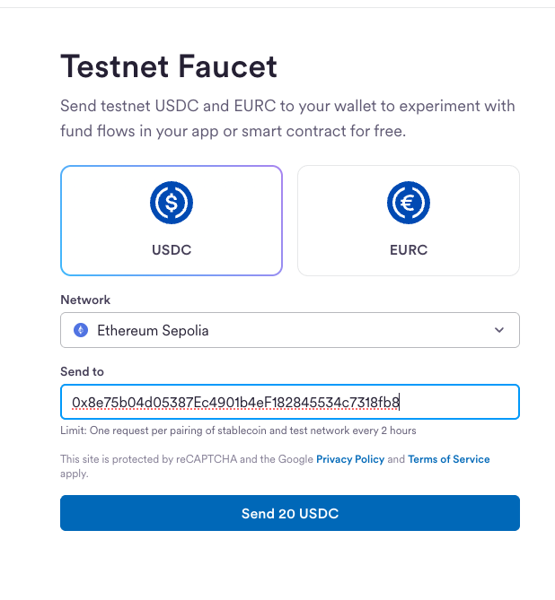
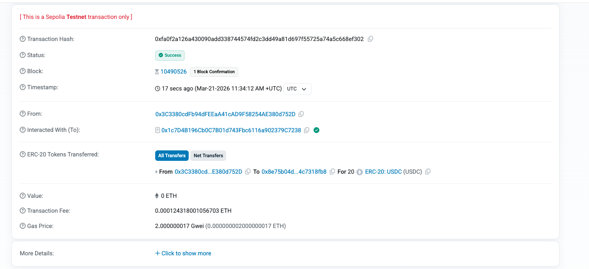

# StableBridge Indexer — Live Testnet Test (Sepolia)

> End-to-end verification of the indexer pipeline against Ethereum Sepolia testnet.
> Date: 2026-03-21 | Chain: Sepolia | Token: USDC

---

## Test Summary

| Item | Detail |
|------|--------|
| **Chain** | Ethereum Sepolia (EVM) |
| **Token** | USDC (`0x1c7D4B196Cb0C7B01d743Fbc6116a902379C7238`) |
| **Wallet** | `0x8e75b04d05387ec4901b4ef182845534c7318fb8` |
| **Transaction** | [`0xfa0f2a...ef302`](https://sepolia.etherscan.io/tx/0xfa0f2a126a430090add338744574fd2c3dd49a81d697f55725a74a5c668ef302) |
| **Block** | 10,490,526 |
| **Amount** | 20 USDC (rawAmount: 20000000, decimals: 6) |
| **Result** | Transfer detected, matched, and published to Kafka |

---

## Step 1: Start Infrastructure

Started all services using Terraform (Docker provider):

```bash
make terraform-up-testnet
```

This provisions 7 containers: PostgreSQL, Redis Stack, Redpanda (Kafka), Redpanda Console, Prometheus, Grafana, and the indexer app.

**Startup logs:**

```
EvmChainIndexerFactory - Created EvmChainIndexer for networkId=sepolia, chainId=SEPOLIA,
    useFinalizedTag=true, minConfirmations=0, indexNativeTransfers=true, tokenContracts=2
KafkaTopicConfiguration - Auto-creating Kafka topic: transfer.events.sepolia
IndexerOrchestrator - Initialized bloom filter — networkType=EVM, addressCount=0
BaseWorker - Worker state changed — from=STOPPED, to=RUNNING, chain=SEPOLIA, workerType=REGULAR
BaseWorker - Worker state changed — from=STOPPED, to=RUNNING, chain=SEPOLIA, workerType=CATCHUP
BaseWorker - Worker state changed — from=STOPPED, to=RUNNING, chain=SEPOLIA, workerType=RESCAN
IndexerOrchestrator - Started workers for chain=SEPOLIA, pollInterval=PT5S, batchSize=3
StablebridgeIndexerApplication - Started StablebridgeIndexerApplication in 7.113 seconds
```

---

## Step 2: Register Wallet Address

Registered a MetaMask Sepolia wallet via the API:

```bash
curl -X POST http://localhost:8080/api/v1/wallets \
  -H "X-API-Key: $INDEXER_API_KEY" \
  -H "Content-Type: application/json" \
  -d '{"address": "0x8e75b04d05387Ec4901b4eF182845534c7318fb8", "networkType": "EVM"}'
```

**Response:**

```json
{
  "id": 3,
  "address": "0x8e75b04d05387ec4901b4ef182845534c7318fb8",
  "networkType": "EVM",
  "active": true,
  "createdAt": "2026-03-21T11:48:34.905Z"
}
```

### What Happens Inside

When you register a wallet, this is the internal flow:

```
POST /api/v1/wallets {"address": "0xABC...", "networkType": "EVM"}
          |
          v
ApiKeyAuthFilter
  Validates the X-API-Key header against the configured key.
  Rejects with 401 if missing or wrong.
          |
          v
WalletController
  Receives the request, maps the API DTO to domain types.
          |
          v
WalletCommandHandler.addWallet()
  1. Normalizes address to lowercase (EIP-55 mixed case -> lowercase)
  2. Saves to PostgreSQL (wallet_addresses table, unique constraint on address+network_type)
  3. Adds the lowercase address to the Redis Bloom filter via BF.ADD
          |
          v
Response: 201 Created
```

**Key points:**

- **No restart needed** — the Bloom filter is live in Redis. The very next block the `RegularWorker` processes will check transfers against the updated filter.
- **Per-network-type scope** — registering with `networkType=EVM` watches the address across **all enabled EVM chains** (Sepolia, Ethereum, Base, etc.) because they share one Bloom filter (`indexer:bloom:EVM`).
- **Case normalization** — addresses are stored and checked in lowercase. This is critical because MetaMask uses EIP-55 mixed-case checksums (`0x8e75b04d05387Ec4...`) but blockchain data is always lowercase (`0x8e75b04d05387ec4...`).
- **Duplicate protection** — PostgreSQL enforces a unique constraint on `(address, network_type)`. Registering the same address twice returns `409 Conflict`.

**Bloom filter log:**

```
RedisBloomAddressFilter - Added address to Redis bloom filter
    — networkType=EVM, address=0x8e75b04d05387ec4901b4ef182845534c7318fb8
```

From this moment, the matching pipeline activates for every block:

```
For each transfer in each new block:
  1. Bloom check:  BF.EXISTS indexer:bloom:EVM "0x8e75b04d..."  -> 1 (hit, sub-ms)
  2. DB confirm:   SELECT EXISTS FROM wallet_addresses           -> true (zero false positives)
  3. Kafka publish: transfer.events.SEPOLIA, key=toAddress       -> event delivered
  4. Redis save:   HSET indexer:progress SEPOLIA <blockNumber>   -> progress recorded
```

---

## Step 3: Send Testnet USDC via Circle Faucet

Requested 20 USDC from the [Circle Testnet Faucet](https://faucet.circle.com):

- Selected **Ethereum Sepolia** network
- Selected **USDC** token
- Pasted wallet address
- Clicked "Send 20 USDC"



---

## Step 4: Verify Transaction on Etherscan

The faucet sent 20 USDC in transaction [`0xfa0f2a...ef302`](https://sepolia.etherscan.io/tx/0xfa0f2a126a430090add338744574fd2c3dd49a81d697f55725a74a5c668ef302):



| Field | Value |
|-------|-------|
| Transaction Hash | `0xfa0f2a126a430090add338744574fd2c3dd49a81d697f55725a74a5c668ef302` |
| Status | Success |
| Block | 10,490,526 |
| From | `0x3C3380cdFb94dFEEaA41cAD9F58254AE380d752D` (Circle faucet) |
| To (contract) | `0x1c7D4B196Cb0C7B01d743Fbc6116a902379C7238` (Sepolia USDC) |
| ERC-20 Transfer | 20 USDC to `0x8e75b04d...4c7318fb8` |
| Timestamp | Mar-21-2026 11:34:12 AM UTC |

---

## Step 5: Indexer Detects the Transfer

The indexer processed block 10,490,526 and matched the USDC transfer to the registered wallet:

### 5a. Block Fetched and Parsed

```
EvmRpcClient - RPC request: method=eth_getBlockByNumber, params=[0xa0129e, true]
EvmChainIndexer - Indexed block 10490526 on SEPOLIA: 27 transfers
```

27 transfers were found in the block. The ERC-20 parser identified the USDC transfer to our wallet:

```
EvmErc20TransferParser - Parsed ERC-20 transfer:
    token=USDC
    from=0x3c3380cdfb94dfeeaa41cad9f58254ae380d752d
    to=0x8e75b04d05387ec4901b4ef182845534c7318fb8
    rawAmount=20000000
    on chain=SEPOLIA
```

### 5b. Bloom Filter Match + DB Confirm

The transfer's `toAddress` was checked against the Bloom filter (sub-millisecond) and confirmed against the PostgreSQL `wallet_addresses` table:

```
BaseWorker - Transfer matched
    — direction=INCOMING
    txHash=0xfa0f2a126a430090add338744574fd2c3dd49a81d697f55725a74a5c668ef302
    walletAddress=0x8e75b04d05387ec4901b4ef182845534c7318fb8
    tokenSymbol=USDC
```

### 5c. Published to Kafka

```
BaseWorker - Published 1 transfer events — blockNumber=10490526
BaseWorker - Block processed — blockNumber=10490526, transfers=1, latency_ms=1709
```

---

## Step 6: Verify Kafka Event

Read the event from the Kafka topic `transfer.events.SEPOLIA`:

```bash
docker exec indexer-redpanda rpk topic consume transfer.events.SEPOLIA \
  --brokers localhost:9092 -n 1
```

**Kafka Event:**

```json
{
  "topic": "transfer.events.SEPOLIA",
  "key": "0x8e75b04d05387ec4901b4ef182845534c7318fb8",
  "value": {
    "txHash": "0xfa0f2a126a430090add338744574fd2c3dd49a81d697f55725a74a5c668ef302",
    "fromAddress": "0x3c3380cdfb94dfeeaa41cad9f58254ae380d752d",
    "toAddress": "0x8e75b04d05387ec4901b4ef182845534c7318fb8",
    "rawAmount": "20000000",
    "amount": 20,
    "decimals": 6,
    "tokenSymbol": "USDC",
    "tokenContractAddress": "0x1c7d4b196cb0c7b01d743fbc6116a902379c7238",
    "blockNumber": 10490526,
    "blockHash": "0x95a542b02ba1ef60df173202bfb1f884a915e647c37f47e1d730b92678a7fd19",
    "transactionIndex": 2,
    "logIndex": 2,
    "chainId": "SEPOLIA",
    "networkType": "EVM",
    "timestamp": "2026-03-21T11:34:12Z",
    "nativeTransfer": false,
    "direction": "INCOMING",
    "detectedAt": "2026-03-21T11:49:30.281Z"
  },
  "partition": 0,
  "offset": 0
}
```

**Event validation:**

| Field | Expected | Actual | Match |
|-------|----------|--------|-------|
| txHash | `0xfa0f2a...ef302` | `0xfa0f2a...ef302` | Yes |
| toAddress | `0x8e75b04d...` | `0x8e75b04d...` | Yes |
| fromAddress | `0x3c3380cd...` | `0x3c3380cd...` | Yes |
| rawAmount | `20000000` | `20000000` | Yes |
| amount | `20` | `20` | Yes |
| decimals | `6` | `6` | Yes |
| tokenSymbol | `USDC` | `USDC` | Yes |
| blockNumber | `10490526` | `10490526` | Yes |
| direction | `INCOMING` | `INCOMING` | Yes |
| nativeTransfer | `false` | `false` | Yes |
| key (partition) | `toAddress` | `0x8e75b04d...` | Yes |

---

## Step 7: Verify Infrastructure State

### Redis Block Progress

```bash
docker exec indexer-redis redis-cli HGETALL indexer:progress
```

```
SEPOLIA
10490528
```

The indexer has progressed past the target block.

### Redis Bloom Filter

```bash
docker exec indexer-redis redis-cli BF.INFO indexer:bloom:EVM
```

**What does "0.1% false positive rate" mean?**

A Bloom filter is a fast, space-efficient data structure that answers "Is this address in the set?" It has two possible outcomes:

- **"No"** — the address is definitely NOT in the set (100% certain, zero false negatives)
- **"Maybe yes"** — the address is probably in the set, but there's a 0.1% chance it's wrong (false positive)

This is why the indexer uses **Bloom + DB confirm** (double-check pattern):

```
Block with 100 transfers:
  99 non-matching  → Bloom says "No"        → skip (sub-ms, no DB query)
  1 actual match   → Bloom says "Maybe yes" → DB confirms "Yes" → publish to Kafka
  ~0.1 false positive → Bloom says "Maybe yes" → DB says "No"   → discard (no harm)
```

The Bloom filter eliminates 99.9%+ of transfers without touching PostgreSQL. Only the rare Bloom hits (real matches + the occasional false positive) reach the database. This keeps DB load minimal even at millions of transfers per day, while guaranteeing **zero false positives** for financial correctness.

### PostgreSQL Wallet

```bash
docker exec indexer-postgres psql -U indexer -d indexer \
  -c "SELECT * FROM wallet_addresses;"
```

| id | address | network_type | active |
|----|---------|-------------|--------|
| 3 | `0x8e75b04d05387ec4901b4ef182845534c7318fb8` | EVM | true |

---

## Worker Auto-Recovery

During the test, the Sepolia worker hit Alchemy rate limits (HTTP 429) and auto-recovered:

```
EvmRpcClient - RPC call failed: method=eth_getBlockByNumber, statusCode=429
BaseWorker - Worker state changed — from=RUNNING, to=PARKED, chain=SEPOLIA
  ... (60 second health probe) ...
BaseWorker - Worker state changed — from=PARKED, to=RUNNING, chain=SEPOLIA
```

The PARKED → RUNNING auto-recovery worked as designed. The worker probes the RPC every 60 seconds and resumes when the rate limit window resets.

---

## Bug Found and Fixed During Testing

### Address Case Sensitivity

**Problem:** MetaMask provides addresses in EIP-55 mixed case (`0x8e75b04d05387Ec4901b4eF182845534c7318fb8`) but blockchain data uses lowercase (`0x8e75b04d05387ec4901b4ef182845534c7318fb8`). The Bloom filter's `BF.EXISTS` is an exact string match — the mixed-case address in the filter never matched the lowercase address from parsed transfers.

**Symptom:** `Block processed — blockNumber=10490526, transfers=0` — block was parsed correctly (27 transfers found, including the USDC transfer to our wallet) but zero matched because the Bloom filter lookup failed.

**Fix:** Normalize all addresses to lowercase in:
- `RedisBloomAddressFilter.add()` and `mightContain()`
- `GuavaBloomAddressFilter.add()` and `mightContain()`
- `WalletCommandHandler.addWallet()` — store lowercase in PostgreSQL
- Both `contains()` methods — query with lowercase

**Verification:** After the fix, replayed block 10,490,526 by resetting Redis progress:

```bash
docker exec indexer-redis redis-cli HSET indexer:progress SEPOLIA 10490523
docker restart indexer-app
```

Result: `Transfer matched — direction=INCOMING, txHash=0xfa0f2a..., tokenSymbol=USDC`

---

## Pipeline Summary

```
Circle Faucet sends 20 USDC to 0x8e75b04d...
          ↓
Sepolia block 10,490,526 (finalized after ~13 min)
          ↓
EvmRpcClient fetches block via eth_getBlockByNumber
          ↓
EvmErc20TransferParser finds USDC Transfer event log
  from=0x3c3380cd... to=0x8e75b04d... rawAmount=20000000
          ↓
RedisBloomAddressFilter.mightContain("0x8e75b04d...") → true (sub-ms)
          ↓
WalletAddressRepository.existsByAddress("0x8e75b04d...") → true (DB confirm)
          ↓
KafkaTransferEventPublisher → transfer.events.SEPOLIA (key=toAddress)
          ↓
RedisBlockProgressStore.saveLastProcessedBlock(SEPOLIA, 10490526)
```

**Total detection latency:** ~1.7 seconds (block fetch + parse + match + Kafka publish)

---

## Teardown

```bash
make terraform-down
```

Destroys all 18 Terraform-managed resources (containers, volumes, network, images).
